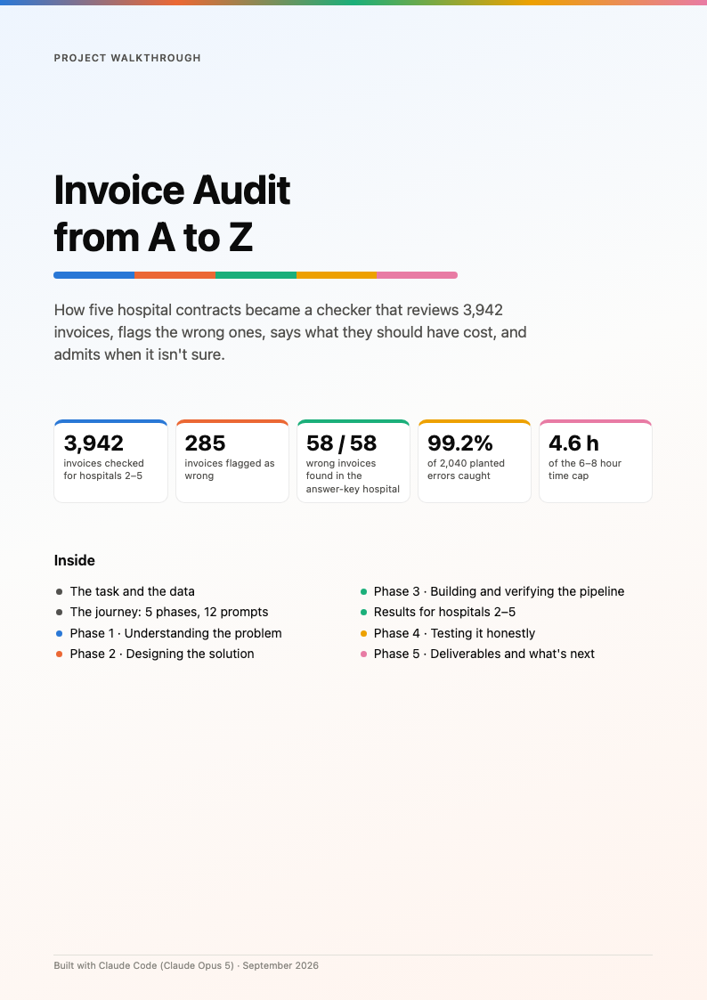
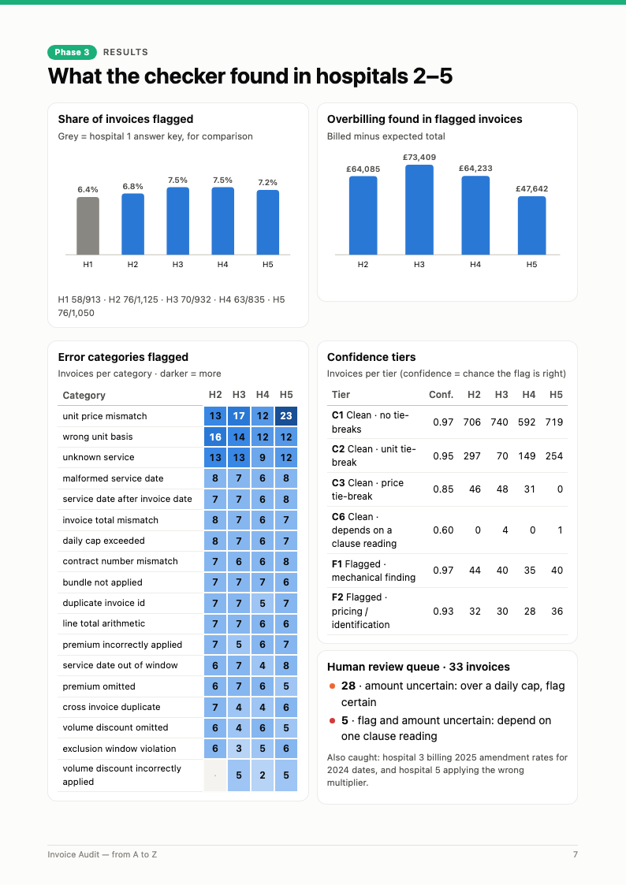

# Invoice Audit — Submission

Checks every invoice from hospitals 2–5 against that hospital's contract. For each invoice it reports
whether it is wrong, why, what it should have totalled, and how confident the check is. Hospital 1's
labels are used only for development and calibration. The original exercise brief is in
[docs/exercise_brief.md](docs/exercise_brief.md).

## Start here

1. **[Write-up (2 pages)](WRITEUP.md)** ([PDF](docs/Writeup.pdf)): how I measured the results, where I was
   uncertain and why, and what I would do differently with another week.
2. **Visual walkthrough**, below.

## Visual walkthrough

**[Invoice Audit — from A to Z (PDF, 11 pages)](docs/Invoice_Audit_A_to_Z.pdf)** explains the whole project
with charts: the task, the five phases, how the checker works, the results, the stress test, and the known
weaknesses. Click a page to open it.

<a href="docs/Invoice_Audit_A_to_Z.pdf"></a>
<a href="docs/Invoice_Audit_A_to_Z.pdf"></a>

## Reproduce `submission.csv`

```bash
python3 -m audit                         # parse contracts -> check invoices -> submission.csv + outputs/
python3 -m unittest discover -s tests    # 12 tests
```

- Python 3.14.2, standard library only (`requirements.txt`, `.python-version`). Runs in about 4 seconds.
- **No LLM or API key is needed to reproduce.** The LLM outputs used for verification are committed.

| Other command | Produces |
|---|---|
| `python3 -m audit rules` | `rules/hospital_N.json` from the contracts |
| `python3 -m audit verify` | `verification/report.md` |
| `python3 -m audit.evaluation` | `outputs/evaluation/scorecard.md`, `ablation.md` |
| `python3 -m audit.stress` | `outputs/evaluation/stress_*.{csv,md}`, `lookalike_seeds.md` (~1 min) |
| `python3 -m audit.llm_extract_contracts` / `audit.llm_map_descriptions` | Re-run the LLM steps. Needs a logged-in Claude Code CLI; skips outputs that already exist unless `--force`. |

## Deliverables

| # | Deliverable | Where |
|---|---|---|
| 1 | Runnable repository | this README; `audit/`, `tests/` |
| 2 | Submission | [submission.csv](submission.csv): 3,942 rows (H2–H5, one per invoice ID) |
| 3 | Evaluation report | [docs/evaluation_report.md](docs/evaluation_report.md) |
| 4 | Prompts, versioned | [prompts/session/](prompts/session/) (every prompt given to the assistant, verbatim) and [prompts/pipeline/](prompts/pipeline/) (prompts the code sends to the LLM) |
| 5 | Decision log | [docs/decision_log.md](docs/decision_log.md) |
| — | What I would do next | [docs/next_steps.md](docs/next_steps.md) |
| — | Write-up (≤ 2 pages) | [WRITEUP.md](WRITEUP.md) · [docs/Writeup.pdf](docs/Writeup.pdf) |
| — | Visual walkthrough (PDF) | [docs/Invoice_Audit_A_to_Z.pdf](docs/Invoice_Audit_A_to_Z.pdf) |

Supporting outputs: [outputs/review_queue.csv](outputs/review_queue.csv) (33 invoices for a person, each
with `review_type`: flag or amount uncertain, and a reason), `outputs/predictions_detailed.csv`
(every invoice with line-level findings), [verification/report.md](verification/report.md).

## How it works

1. **Contracts → rules** (`audit/contracts.py`). Deterministic parsers: a Markdown-table reader (H1, H3,
   H4, H5) and a sentence-pattern reader for H2's prose. 830/830 internal consistency checks pass.
2. **Verification** (`audit/verify.py`). Parser checks; an independent LLM reading of every contract
   (0 differences); and for every service, the share of billed prices equal to our price (≥96%).
3. **Descriptions → services** (`audit/mapping.py`). Abbreviation-aware matching. Ties are broken by
   billed unit, then price, at lower confidence. An LLM text-only second opinion covers every non-exact
   match (`mappings/`).
4. **Checks and pricing** (`audit/engine.py`). All invoices of a hospital are processed together in
   service-date order: header, dates, unit, arithmetic, bundle → facility → tier → premium → discount
   (half-up rounding each step), caps, exclusion windows, cross-invoice duplicates.
5. **Ambiguity test** (`audit/pipeline.py`). Re-run under alternative clause readings; any invoice whose
   answer changes is marked.
6. **Confidence** (`audit/confidence.py`). Evidence tiers for the flag (the submission's `confidence`)
   plus a separate amount confidence for the review queue.

**Results.** H1 (development set): 58/58 erroneous invoices flagged, 0 false alarms, expected total exact
on 909/913. A stress test planting 2,040 known errors into all five hospitals flags 99.2%, and every
miss is routed to review. Four systematic weaknesses are described in the evaluation report.

## Repository map

```
audit/            pipeline code (see "How it works")
tests/            unittest suite
rules/            contracts as structured rules (generated)
verification/     extraction checks + saved LLM contract readings
mappings/         saved LLM second opinions on descriptions
outputs/          review queue, detailed predictions, evaluation tables
docs/             phase 1 understanding, phase 2 design, evaluation report, decision log, next steps
prompts/          session prompts (verbatim) and pipeline prompts (versioned)
contracts/ invoices/ labels/ submission_template.csv   exercise inputs, unchanged
```

## Time and AI assistance

About **4.6 hours** of the 6–8 hour cap: understanding ~0.6, design ~0.6, implementation ~1.8,
evaluation ~1.1, write-up ~0.5 (per-prompt estimates in `prompts/session/`, excluding a pause while a
subscription usage limit reset).

Built with Claude Code (Claude Opus 5):
- Every prompt given to the assistant is stored verbatim in `prompts/session/` (001–012), with what was
  done and why.
- The pipeline's own LLM calls ran through `claude -p` (`audit/llm.py`). Each saved output records model,
  date, prompt file and Claude Code version.
- Both pipeline prompts are still v1: contract extraction matched the parser exactly, and the mapping
  prompt's proposed v2 is described in next steps.
- The LLM never prices an invoice. It only cross-checks the parsers and gives a second opinion on
  uncertain description matches.
